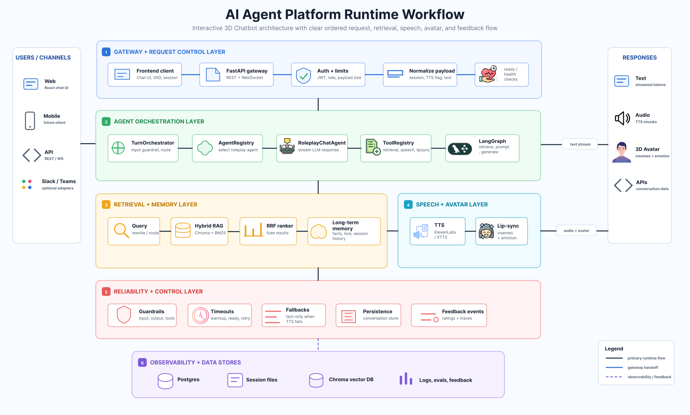
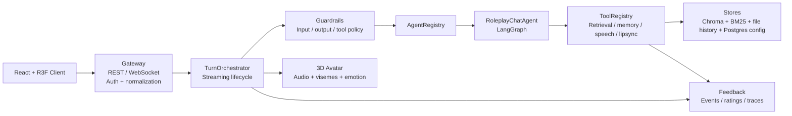

# Persona Graph AI — Real-Time Multimodal AI Agent Platform

An async FastAPI + WebSocket AI platform that powers a real-time 3D companion experience. The system combines LangGraph orchestration, hybrid Chroma + BM25 memory retrieval, tool-wrapped multimodal services, guardrails, feedback events, production-hardening boundaries, and a React Three Fiber avatar driven by audio, emotion, and viseme payloads.

This is not only a chatbot UI. It is a small AI engineering platform built around the model:

```text
Gateway -> Orchestrator -> AgentRegistry -> Agent -> ToolRegistry -> Guardrails -> Feedback
```

## Production AI Engineering Highlights

| Engineering Problem | Implementation |
|---|---|
| Keep user/character memories isolated | Metadata-scoped retrieval by `user_id` and `character_id`; Stage 7 derives `user_id` from auth/dev context instead of trusting the client payload. |
| Recover exact facts that embeddings miss | Hybrid dense Chroma retrieval + sparse BM25 retrieval, fused with Reciprocal Rank Fusion. |
| Make a slow LLM response feel immediate | Token streaming is bridged into sentence-level chunks so TTS/avatar output can start before the full response is complete. |
| Avoid coupling orchestration to concrete services | Retrieval, memory persistence, speech, lip-sync, and STT are exposed through `ToolRegistry`. |
| Add control and auditability | Input/output/tool guardrails, feedback events, ratings, trace summaries, smoke scripts, and regression tests. |
| Move beyond prototype trust boundaries | WebSocket auth context, request size limits, rate limits, file-backed session history, `/ready`, and Postgres Compose wiring. |

## Workflow Diagram



The diagram traces one request end to end across six layers:

1. **Gateway + Request Control** — Frontend client (chat UI, VAD, session) -> FastAPI gateway (REST + WebSocket) -> Auth (JWT, rate limits, payload size) -> payload normalization (session, TTS flag, text) -> readiness/health checks.
2. **Agent Orchestration** — `TurnOrchestrator` (input guardrail, routing) -> `AgentRegistry` (select roleplay agent) -> `RoleplayChatAgent` (stream LLM response) -> `ToolRegistry` (retrieval, speech, lip-sync) -> LangGraph (retrieve -> prompt -> generate).
3. **Retrieval + Memory** — query rewrite/routing -> hybrid RAG (Chroma + BM25) -> RRF ranker fuses results -> long-term memory (facts, lore, session history).
4. **Speech + Avatar** — TTS (ElevenLabs / XTTS) -> lip-sync (visemes + emotion) -> audio and avatar payloads streamed back to the client.
5. **Reliability + Control** — guardrails (input/output/tool), timeouts (warmup, ready, retry), fallbacks (text-only when TTS fails), conversation persistence, feedback events (ratings + traces).
6. **Observability + Data Stores** — Postgres, session files, Chroma vector DB, logs/evals/feedback.

Users/channels (Web, Mobile, API, Slack/Teams adapters) enter through the gateway; responses come back as streamed text, audio chunks, 3D avatar visemes/emotion, or API payloads.

## Agent Platform Architecture



Runtime path:

```text
Client
  -> Gateway (/ws/chat)
  -> Auth context + request normalization
  -> TurnOrchestrator
  -> GuardrailPipeline.check_input()
  -> AgentRegistry.select()
  -> RoleplayChatAgent.stream()
  -> LangGraph
     -> retrieve_memory tool
     -> retrieve_character_context tool
     -> build_prompt
     -> generate
     -> persist_memory tool
  -> output guardrail cleanup
  -> synthesize_speech tool or text-only fallback
  -> generate_visemes tool when audio exists
  -> WebSocket audio_chunk/done/error
  -> Feedback events and ratings
```

## Hybrid Retrieval And Relevance Evaluation

The memory subsystem combines:
- structured fact retrieval for exact identity facts
- ChromaDB dense retrieval for semantic recall
- BM25 sparse retrieval for keyword/name recall
- Reciprocal Rank Fusion for result merging
- cross-user and cross-character isolation checks

Eval commands:

```bash
cd backend
python scripts/eval_retrieval.py
python scripts/eval_answer_quality.py
```

See [RAG Workflow](docs/architecture/RAG_WORKFLOW.md) and [Stage 5 Retrieval Metrics](docs/STAGE_5_RETRIEVAL_METRICS.md).

## Guardrails And Feedback Loop

Current controls:
- empty/oversized input blocking
- suspicious override pattern observation
- per-agent tool allowlist
- memory-scope checks
- output cleanup
- feedback event/rating JSONL store with redaction
- trace summaries for latency, tool failures, guardrail blocks, and ratings

See [Stage 4 Guardrails/Feedback Audit](docs/STAGE_4_ARCHITECTURE_AUDIT.md) and [Stage 6 Observability Report](docs/STAGE_6_OBSERVABILITY_REPORT.md).

## Monitoring And Reliability

The backend includes:
- smoke scripts from Stage 1 through Stage 7
- pytest coverage for routing, streaming, guardrails, tools, traces, and text-only orchestration
- `/health` for basic health
- `/ready` for app/LLM/vector/session-history/database/TTS readiness
- graceful text-only fallback when TTS is unavailable
- empty-viseme fallback when Rhubarb is unavailable

Latest known backend result:

```text
15 passed
```

## Stack

| Layer | Tech |
|---|---|
| Backend | FastAPI, WebSockets, asyncio, Pydantic v2 |
| Orchestration | LangChain, LangGraph, LangSmith optional tracing |
| Agents/Tools | AgentRegistry, ToolRegistry, RoleplayChatAgent |
| Memory/RAG | ChromaDB dense retrieval, BM25 sparse retrieval, RRF |
| LLM | Ollama / vLLM OpenAI-compatible / DeepSeek |
| TTS | ElevenLabs / Coqui XTTS-v2 / text-only fallback |
| STT | faster-whisper, disabled-safe fallback |
| Lip-sync | Rhubarb Lip-Sync |
| Frontend | React, TypeScript, Vite, React Three Fiber, Three.js, Zustand |
| Production bridge | Postgres Compose service, file-backed session history, auth/rate-limit middleware |

## Running Locally

Backend:

```bash
cd backend
pip install -r requirements.txt
cp .env.example .env
uvicorn app.main:app --reload
```

Frontend:

```bash
cd frontend
npm install
npm run dev
```

Default local dev backend port is `8001` to avoid common conflicts with other API projects. The frontend uses `VITE_BACKEND_PORT` when set and otherwise connects to `localhost:8001`.

Docker:

```bash
cp backend/.env.example backend/.env
docker compose up --build
docker compose exec ollama ollama pull llama3:8b
docker compose exec ollama ollama pull nomic-embed-text
```

## Smoke And Regression

```bash
cd backend
python scripts/smoke_baseline.py
python scripts/smoke_stage2.py
python scripts/smoke_stage3.py
python scripts/smoke_stage4.py
python scripts/smoke_stage5.py
python scripts/smoke_stage6.py
python scripts/smoke_stage7.py
python -m pytest -q
```

`/health` or `/ready` may report `degraded` when the configured LLM provider is not running. That means readiness is working, not that the endpoint failed.

## Demo And Portfolio Docs

- [Project Workflow](docs/architecture/WORKFLOW.md)
- [RAG Workflow](docs/architecture/RAG_WORKFLOW.md)
- [Portfolio Case Study](docs/PORTFOLIO_CASE_STUDY.md)
- [Interview Prep](docs/INTERVIEW_PREP.md)
- [AI Agent Platform Plan](docs/AI_AGENT_PLATFORM_WORKFLOW_IMPLEMENTATION_PLAN.md)
- [Postgres Production Upgrade Plan](docs/POSTGRES_PRODUCTION_UPGRADE_PLAN.md)

## Known Gaps / Next Steps

- Postgres-backed feedback and audit logs.
- Alembic migrations, refresh-token rotation, Postgres-backed feedback/audit logs.
- Redis or another shared rate limiter for multi-process deployment.
- Stronger answer verification/citation checking.
- More robust sentence segmentation for decimals, abbreviations, and nested punctuation.
- Stage beyond MVP: additional task/research/coding agents with planner/executor loops.

## Positioning

The project started as an interactive 3D chatbot, but the architecture now demonstrates a broader AI platform direction: explicit orchestration, retrieval quality, multimodal tool wrapping, guardrails, feedback loops, evaluation, and production hardening.
