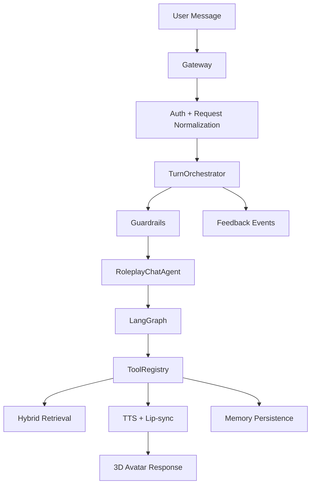

# Portfolio Case Study - Interactive 3D AI Agent Platform

## Problem

Most chatbot demos are stateless wrappers around an LLM call. A more realistic AI companion needs memory, isolation, low perceived latency, multimodal output, observability, feedback, and production controls.

This project asks: what does the layer around the model look like when the product needs to feel real-time, remember context, and avoid mixing data between users or characters?

## Architecture

The backend is organized as a platform workflow:

```text
Gateway
  -> TurnOrchestrator
  -> Guardrails
  -> AgentRegistry
  -> RoleplayChatAgent
  -> ToolRegistry
  -> Feedback
```

The frontend renders:
- chat messages
- audio playback
- voice interruption
- emotion state
- Rhubarb-driven visemes
- a React Three Fiber avatar



## Key Engineering Decisions

| Decision | Why It Matters |
|---|---|
| LangGraph state machine | Makes retrieval, prompt building, generation, and memory persistence explicit and traceable. |
| AgentRegistry + ToolRegistry | Separates behavior selection from concrete service calls and enables tool policy enforcement. |
| Hybrid Chroma + BM25 retrieval | Improves both semantic recall and exact keyword/fact recall. |
| Sentence-level streaming bridge | Reduces perceived latency by starting TTS/avatar output before the full LLM response completes. |
| JSONL feedback first | Keeps the feedback loop inspectable while Postgres persistence is still pending. |
| Stage 7 auth/session boundary | Prevents trusting client-supplied `user_id` and namespaces history by authenticated user. |

## Retrieval And Evaluation

The retrieval subsystem uses:
- structured facts for identity-like recall
- Chroma dense search for semantic similarity
- BM25 sparse search for exact terms
- Reciprocal Rank Fusion for merging ranked lists
- evaluation cases for fact recall, keyword recall, paraphrase recall, and cross-character isolation

Current local baseline from Stage 5:

```text
retrieval eval: pass
recall_at_5=1.0
mrr=1.0
forbidden_hit_count=0
```

## Guardrails And Feedback

Guardrails cover:
- empty/oversized input
- tool allowlists
- memory-scope checks
- prompt-injection observation for retrieved context
- output cleanup

Feedback events cover:
- turn lifecycle
- agent selection
- first token/response/audio latency
- tool calls and failures
- guardrail blocks
- user ratings

## Reliability Work

Implemented reliability pieces:
- smoke scripts through Stage 7
- backend regression tests
- retrieval eval
- answer-quality eval
- readiness endpoint
- provider fallback behavior
- optional text-only operation

Latest known backend result:

```text
15 passed
```

## Failure Handling

| Failure | Degraded Behavior |
|---|---|
| LLM provider down | Health/readiness reports degraded; live turn emits error payload. |
| TTS unavailable | Text-only audio chunk is sent. |
| Rhubarb unavailable | Audio still sends with empty visemes. |
| Retrieval tool fails | Prompt is generated without memory context. |
| Feedback write fails | User turn continues; error is logged. |
| WebSocket disconnect | Current turn is cancelled and queues are cleaned up. |

## What Would Change For Fintech Production

For a fintech or payments-grade environment, the next production changes would be:
- full Postgres-backed users/conversations/messages/audit logs
- password hashing and refresh-token rotation
- row-level authorization for every conversation/message endpoint
- strict PII redaction and retention policy
- stronger prompt-injection and data-exfiltration controls
- Redis-backed distributed rate limiting
- eval gates before prompt/model rollout
- dashboarded metrics and alerting

## Five-Minute Demo Flow

1. **Architecture:** show the README diagram and explain the platform layers.
2. **Streaming:** run a chat turn and explain token-to-sentence buffering.
3. **Memory:** save a user fact and ask the assistant to recall it.
4. **Tools/Guardrails:** open `backend/app/tools/registry.py` and `backend/app/guardrails/`.
5. **Feedback/Observability:** show feedback events and trace summary concepts.
6. **Hardening:** show `auth.py`, `rate_limit.py`, `session_history.py`, and `/ready`.

## Honest Gaps

- Full Postgres persistence remains pending.
- Frontend auth flow remains pending.
- Guardrails are still rule-based and conservative.
- Sentence segmentation is regex-based and should be upgraded for complex punctuation.
- The current agent is not yet a full autonomous planner/executor loop.
