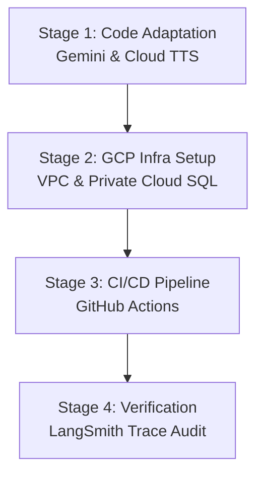

# GCP Deployment, LangSmith Observability, and GitHub Actions CI/CD Implementation Plan

This plan details the steps to migrate from local engines (Ollama, local ChromaDB, local XTTS) to a secure, enterprise-grade serverless architecture on Google Cloud Platform (GCP). It integrates Gemini API for LLM/Embeddings, Google Cloud TTS, LangSmith for live trace monitoring, and GitHub Actions for continuous delivery.

---

## Stages Overview



---

## Stage 1: Code Adaptation for GCP & Gemini

We will modify the backend codebase to support native Google GenAI integrations and GCP TTS adapters, keeping existing local providers as configurable fallbacks.

### 1.1 Config Extensions
Add configurations in [config.py](file:///d:/Coder-IT/AI/persona-graph-ai/backend/app/config.py):
* `gemini_api_key`: API key for Google AI Studio.
* `tts_provider`: Add `"google-cloud"` option.
* GCP TTS settings: `google_tts_voice_name` (e.g., `vi-VN-Neural2-A`), `google_tts_language_code` (`vi-VN`).

### 1.2 LLM Adapter
Modify [llm_handler.py](file:///d:/Coder-IT/AI/persona-graph-ai/backend/app/llm_handler.py):
* Create `GeminiHandler(BaseLLMHandler)` using `google-genai` or `langchain-google-genai` to stream tokens with emotion tagging rules.
* Update factory function `get_llm_handler()` to instantiate it when `llm_provider == "gemini"`.

Modify [lc_chain.py](file:///d:/Coder-IT/AI/persona-graph-ai/backend/app/lc_chain.py):
* Add import for `ChatGoogleGenAI`.
* Update `build_chain()` to support Gemini.

### 1.3 Embeddings Adapter
Modify [memory_store.py](file:///d:/Coder-IT/AI/persona-graph-ai/backend/app/memory_store.py):
* Conditionally initialize `embeddings = GoogleGenAIEmbeddings(model="models/text-embedding-004")` if LLM provider is `"gemini"`.

### 1.4 TTS Adapter
Modify [tts_handler.py](file:///d:/Coder-IT/AI/persona-graph-ai/backend/app/tts_handler.py):
* Add `GoogleCloudTTSHandler(BaseTTSHandler)` using `google-cloud-texttospeech` to generate high-quality audio bytes.
* Update `get_tts_handler()` to resolve the new handler.

---

## Stage 2: GCP Infrastructure Setup

Configure a cost-effective, secure private network inside GCP.

### 2.1 Network Setup (VPC & Serverless Access)
* Create a dedicated VPC Network:
  ```bash
  gcloud compute networks create persona-vpc --subnet-mode=custom
  ```
* Provision a Serverless VPC Access Connector:
  ```bash
  gcloud compute networks vpc-access connectors create persona-connector \
      --region=asia-southeast1 \
      --network=persona-vpc \
      --range=10.8.0.0/28
  ```

### 2.2 Cloud SQL (Private Postgres)
* Spin up a PostgreSQL instance with a private IP attached to the VPC:
  ```bash
  gcloud beta sql instances create persona-postgres \
      --database-version=POSTGRES_15 \
      --tier=db-f1-micro \
      --region=asia-southeast1 \
      --network=projects/[PROJECT_ID]/global/networks/persona-vpc \
      --no-assign-ip
  ```
* Enable the `pgvector` extension for semantic searches.

### 2.3 Artifact Registry & IAM
* Create a Docker repository:
  ```bash
  gcloud artifacts repositories create chatbot-repo \
      --repository-format=docker \
      --location=asia-southeast1
  ```
* Create a Service Account for Cloud Run with permission roles:
  * `Vertex AI User`
  * `Cloud SQL Client`
  * `Text-to-Speech API User`

---

## Stage 3: CI/CD Pipeline via GitHub Actions

Automate the deployment pipeline to build, push, and deploy backend/frontend containers to Cloud Run.

### 3.1 GitHub Workflow File
Create [.github/workflows/deploy.yml](file:///d:/Coder-IT/AI/persona-graph-ai/.github/workflows/deploy.yml):
```yaml
name: Deploy to GCP Cloud Run

on:
  push:
    branches:
      - main

jobs:
  test:
    runs-on: ubuntu-latest
    steps:
      - uses: actions/checkout@v4
      - name: Set up Python
        uses: actions/setup-python@v5
        with:
          python-python: '3.12'
      - name: Install dependencies & run tests
        run: |
          cd backend
          pip install uv
          uv pip install -r requirements.txt --system
          pytest tests

  build-and-deploy:
    needs: test
    runs-on: ubuntu-latest
    steps:
      - uses: actions/checkout@v4
      - name: Authenticate to GCP
        uses: google-github-actions/auth@v2
        with:
          credentials_json: ${{ secrets.GCP_SA_KEY }}
          
      - name: Configure Docker for GCP
        run: gcloud auth configure-docker asia-southeast1-docker.pkg.dev
        
      - name: Build and Push Backend Image
        run: |
          docker build -t asia-southeast1-docker.pkg.dev/${{ secrets.GCP_PROJECT_ID }}/chatbot-repo/backend:latest ./backend
          docker push asia-southeast1-docker.pkg.dev/${{ secrets.GCP_PROJECT_ID }}/chatbot-repo/backend:latest
          
      - name: Deploy Backend to Cloud Run
        run: |
          gcloud run deploy chatbot-backend \
            --image=asia-southeast1-docker.pkg.dev/${{ secrets.GCP_PROJECT_ID }}/chatbot-repo/backend:latest \
            --region=asia-southeast1 \
            --vpc-connector=persona-connector \
            --service-account=run-sa@${{ secrets.GCP_PROJECT_ID }}.iam.gserviceaccount.com \
            --set-env-vars="DATABASE_URL=${{ secrets.DATABASE_URL }},LLM_PROVIDER=gemini,TTS_PROVIDER=google-cloud,LANGSMITH_TRACING=true,LANGSMITH_API_KEY=${{ secrets.LANGSMITH_API_KEY }},LANGSMITH_PROJECT=${{ secrets.LANGSMITH_PROJECT }}" \
            --allow-unauthenticated \
            --min-instances=0 \
            --max-instances=3
```

---

## Stage 4: Observability & Verification via LangSmith

Inspect the live token stream, routing decisions, and latency breakdowns in LangSmith.

1. **Enable Tracing:** Ensure these variables are active in Cloud Run:
   * `LANGSMITH_TRACING=true`
   * `LANGSMITH_API_KEY=your_key`
   * `LANGSMITH_PROJECT=persona-graph-ai`
2. **Observe Runs in LangSmith:**
   * **Chat Turn Trace:** Click on a chat trace to view the detailed flow:
     ```text
     [Run: chatbot-turn]
     ├── [Tool: retrieve_facts] (Latency: ~50ms)
     ├── [LLM: ChatGoogleGenAI] (Latency: ~400ms)
     │   └── Token consumption (prompt/completion tokens)
     └── [Tool: synthesize_speech] (Latency: ~200ms)
     ```
   * **Emotion Tags Audit:** Inspect outputs to ensure they conform to formatting constraints (e.g., prepended with `[joy]`, `[neutral]`, etc.).
   * **Cost Control:** Audit monthly API costs directly on the LangSmith Usage dashboard.
